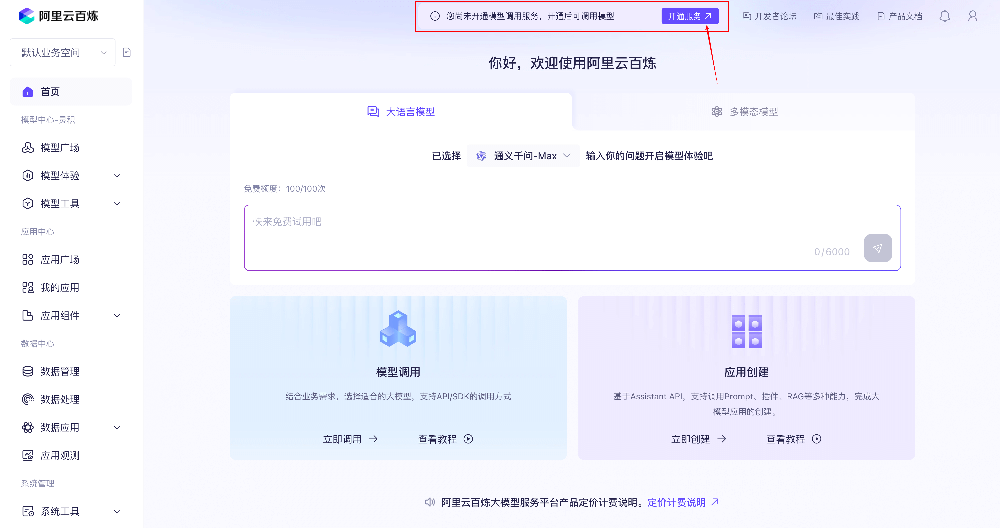
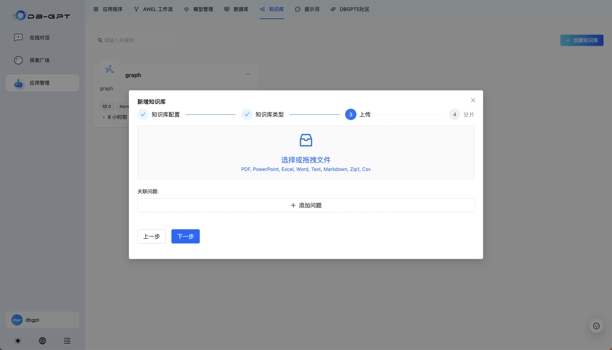

## 实验简介

### Chat Data

`Chat Data` 技术允许用户通过自然语言对话与数据系统进行互动。用户可以提出问题或请求，系统根据用户的意图和历史交互记录，自动生成对数据系统的查询、管理操作，并进一步提供数据可视化、分析能力。

针对关系型数据库场景来说，`Text2SQL` 是 `Chat Data` 的技术核心，其目的是将自然语言查询转换为 SQL。用户可以用简单的自然语言描述他们想要提取的数据，比如“显示2023年销售额最高的产品”，系统能够自动解析并生成相应的 SQL 语句，比如 `SELECT product_name FROM sales WHERE year = 2023 ORDER BY sales_amount DESC LIMIT 1;` 。这种技术在数据库查询、商业智能和数据分析工具中尤为重要，使得非技术用户也能轻松进行复杂的数据查询。

`DB-GPT Chat Data` 应用效果：


### GraphRAG

传统 `RAG` 通常使用向量检索作为文档召回器，在检索精确度方面具有一定的优势，然而在处理诸如 “这篇文章的主题是什么？”、“总结一下文档” 等概括性、综合性问题时存在困难，这些问题通常涉及多个文档知识的整合，要求文档搜索的广度而非精确度。

为了解决这个问题，`GraphRAG` 被提出。该技术创新地提出使用图结构存储外部知识，外部知识通常是"主-谓-宾"结构的，而图结构的节点可以描述主语和宾语，图中的边可以描述谓语，`GraphRAG` 符合知识建模，从而有效提升文档召回和回答质量；此外，社区划分和总结使得在检索时考虑高层级的综合性知识，在保证搜索精度的同时，提升搜索的广度。

`DB-GPT GraphRAG` 应用效果：


## 实验背景

🤖️ **[DB-GPT](https://github.com/eosphoros-ai/DB-GPT)是一个开源的AI原生数据应用开发框架(AI Native Data App Development framework with AWEL(Agentic Workflow Expression Language) and Agents)。**

目的是构建大模型领域的基础设施，通过开发多模型管理(SMMF)、Text2SQL效果优化、RAG框架以及优化、Multi-Agents框架协作、AWEL(智能体工作流编排)等多种技术能力，让围绕数据库构建大模型应用更简单，更方便。 

[OceanBase](https://github.com/oceanbase/oceanbase) 从 4.3.3 版本开始支持了向量数据类型的存储和检索，并且经过适配可以作为 DB-GPT 的可选向量数据库，支持 DB-GPT 对结构化数据和向量数据的存取需求，有力地支撑其上 LLM 应用的开发和落地，同时 DB-GPT 也通过 `chat data`、`chat db` 等应用为 OceanBase 提升易用性。

鉴于传统 RAG 在概括性问题上存在的问题，DB-GPT 实现了一种基于知识图谱进行相关文档召回的 RAG 技术 —— GraphRAG。实现依赖图数据库和向量数据库作为文档数据存储和检索的基础组件。[TuGraph](https://github.com/tuGraph-family/tugraph-db)是作为一个高效的图形数据库，支持高数据量、低延迟查找和快速图形分析的图数据库，可以与 OceanBase 的向量存储功能相结合，共同支持 DB-GPT GraphRAG 功能。

## 技术简介

### Chat Data / NL2SQL / Text2SQL

DB-GPT 的 `chat data` 功能本质是自然语言转SQL技术（或称为`NL2SQL`/`Text2SQL`），原理如下图所示：

**数据导入阶段**

1. 获取数据库内用户表schema
2. 将表名、列名、约束等嵌入为向量
3. 存储到OceanBase向量数据库


**自然语言查询阶段**

1. 提问嵌入+向量搜索
2. 获取相关表schema后生成SQL以及可视化方案
3. 使用获取的数据最终输出


### GraphRAG

**数据导入阶段**

1. 文档分块；
2. 依据文档层级结构，为分块建立父子关系；
3. 使用 LLM 抽取文档块中的实体以及关系三元组：在此过程中使用向量数据库搜索出与当前处理文档块语义接近的块，增强抽取时大模型对上下文的语义理解；
4. 使用社区算法获取出实体关系图中的子图划分，利用大模型为每个子图生成一段总结，向量化后存入数据库；


**查询阶段**

1. 通过社区总结的向量数据库获取出与查询问题相关的topK个社区；
2. 将这些查询结果拼接为一个总的summary，让 LLM 抽取查询所需要的关键词；
3. 获取包含关键词的实体、以及其一跳的邻居实体；
4. 获取文档块，并在 LLM 的提示词中添加实体、关系的描述；


## 实验环境

> 现场体验的用户，无需进行环境配置

- Git
- [Docker](https://docs.docker.com/engine/install/)
- MySQL 客户端（[如何安装](https://www.modb.pro/db/1681843673074589696)）

## 平台搭建步骤

### 1. 获取 OceanBase / TuGraph 数据库

进行实验之前，我们需要先获取 OceanBase 数据库，目前可行的方式有两种：使用 OBCloud 实例或者[使用 Docker 本地部署单机版 OceanBase 数据库](#使用-docker-部署单机版-oceanbase-数据库)。我们在此推荐 OBCloud 实例，因为它部署和管理都更加简单，且不需要本地环境支持。

#### 1.1 注册并开通 OBCloud 实例

进入[OB Cloud 云数据库 365 天免费试用](https://www.oceanbase.com/free-trial?utm_source=ai)页面，点击“立即试用”按钮，注册并登录账号，填写相关信息，开通实例，等待创建完成。

#### 1.2 获取数据库实例连接串

进入实例详情页的“实例工作台”，点击“连接”-“获取连接串”按钮来获取数据库连接串，将其中的连接信息填入后续步骤中创建的 .env 文件内。


#### 1.3 创建数据库

创建数据库以存放示例数据以及向量数据。需要注意的是，在设置数据库名称的时候，为了便于用户在 DB-GPT 前端界面进行后续的操作，**强烈不建议用户使用以下四种名称**：（因为以下四种数据库名被 DB-GPT 保留，用户虽然能成功在 DB-GPT 侧建立连接，但是无法在 Web UI 中进行后续的应用管理操作）

- auth
- dbgpt
- test
- public


#### 1.4 拉取 TuGraph 镜像

> 现场体验的用户，无需拉取，请跳过本步骤

使用以下命令获取：

```bash
docker pull quay.io/oceanbase-devhub/tugraph-runtime-centos7:4.5.0
```

### 2. 申请模型 API KEY

在该后续步骤当中我们将使用阿里云百炼的模型服务，所以需要事先申请 API KEY。

首先，我们需要注册[阿里云百炼](https://bailian.console.aliyun.com/)账号，开通模型调用服务并获取 API Key




### 3. 克隆项目

> 现场体验的用户，请在登录上云服务器后，跳转到[5. 启动 Docker 容器](#5-启动-docker-容器)

为了简化部署流程，我们基于 DB-GPT 的 0.6.2 版本进行了修改，并且上传到了我们 fork 的代码仓库中。使用以下指令下载项目代码：

```bash
git clone https://github.com/oceanbase-devhub/DB-GPT
```

如果上述命令执行遇到问题，可能是访问 github 存在困难，可以使用以下指令从 gitee 获取项目代码：

```bash
git clone https://gitee.com/oceanbase-devhub/DB-GPT.git
```

### 4. 拉取 Docker 镜像

```bash
docker pull quay.io/oceanbase-devhub/dbgpt:latest
```

### 5. 启动 Docker 容器

进入项目代码所在的目录（以克隆 DB-GPT 项目所在的目录为根目录）：

```bash
cd ./DB-GPT/docker/compose_examples
```

执行 `create_container_with_config_check.sh` 脚本：

```bash
./create_container_with_config_check.sh
```

下面请按照脚本要求逐项填写参数配置：


> 如果最后一步提示**预先在DB-GPT中创建 OceanBase 连接失败，请稍后根据教程在 Web UI 中设置**，可以照常进行后续步骤，在使用阶段[手动配置数据库](#创建数据库连接) 连接即可

该脚本会做如下几件事：

* 要求用户设置相关参数，输出会包含各项的当前值，如果认可当前值，回车进行下一项；
* 设置完所有参数后，首先通过尝试一次 embedding 操作来验证 API KEY 设置是否有效；
* 如果 API KEY 验证通过，测试与 OceanBase 是否连通，连通则会进一步初始化测试数据，以便后续的实验步骤，测试数据包括四个表：
    
    1. users：记录了用户的姓名和邮箱；
    2. products：记录了产品的名称和价格；
    3. orders：记录了用户购买产品的订单信息；
    4. plant_and_animal_table：记录了一些动植物名称以及这些名称的向量表示；

* 启动 TuGraph 并等待启动完毕；
* 启动 DB-GPT 服务并等待启动完毕；
* 尝试向 DB-GPT 预先注册好 `chat data` 应用需要的数据库连接，脚本中直接使用 OceanBase 作为目标数据库；


## 访问 DB-GPT 平台

默认情况下，DB-GPT 的前端页面会启动在本机的`5670`端口上，也就是说可以通过访问当前机器的 IP 来访问 DB-GPT 的界面。也就是说如果我在笔记本上运行的话，我在浏览器上访问`localhost`即可（或者是内网 IP）；如果在服务器上部署 DB-GPT，则需要访问服务器的公网 IP。

初始界面下是不包含应用的，点击`应用管理`进入创建流程：


接下来将演示如何创建两种应用类型：

1. 典型的知识库 `RAG` 应用；
2. 基于 `text2SQL` 的 `chat data` 应用；

### 创建知识库

首先选择`知识库`，再点击`创建知识库`：


然后按照配置引导进行设置：

知识库名称、描述可自定义。**本教程默认演示 GraphRAG 功能，所以存储类型选择为`Knowldege Graph`，如需使用完全基于向量搜索的传统 RAG 请选择存储类型为`Vector Store`。**


这里我选择普通文档作为示例，用户可自行尝试其他类型。


点击`选择或拖拽文件`区域，选择符合格式要求的文件


默认选择`自动切片`，点击`切片处理`即可。耐心等待处理完成，处理会自动退出配置界面，并弹出成功消息。**需要注意的是 GraphRAG 相对于传统的 RAG 来说在导入文档、构建索引部分相对耗时，请耐心等待，感兴趣的用户可以在服务部署机器上使用`docker logs -f dbgpt`命令查看处理过程的日志**


然后点击创建好的知识库，点击`查看图谱`，可以看到文档经过处理后的实体-关系图：


### 创建数据库连接

> 在[启动 Docker 容器](#5-启动-docker-容器)步骤，运行`create_container_with_config_check.sh`脚本得到`预先在DB-GPT中创建 OceanBase 连接成功`提示的用户可以跳过此步骤。

点击`数据库`，选择`OceanBase`数据库，`Create Now`：


根据 `OceanBase` 连接串提供的信息设置数据库名、用户名、主机地址、端口等信息（可以与[5. 启动 Docker 容器](#5-启动-docker-容器)一致）


创建成功即可在侧边栏看到连接信息：


### 创建知识库应用和 chat data 应用

选择`应用程序`，点击`创建应用`：


选择`原生应用模式`，应用名称和描述可自行定义：


应用类型选择 `Chat Knowledge`，参数选择我们刚刚创建好的知识库名称，模型在我们的配置下仅有 `tongyi_proxyllm` 可供选择，温度控制模型输出的随机性，值越大，模型输出越随机。设置完毕后保存，就可以看到在应用程序一栏中出现了我们定义的应用。


然后我们继续类似地创建 `chat data` 应用：


应用类型选择 `Chat Data`，参数选择我们刚刚创建好的数据库连接，模型和温度含义与 `Chat Knowledge` 一致。


### 使用应用

回到`应用程序`页面，点击开始对话可以进入使用流程：


知识库应用——直接键入文本进行交互即可：


chat data 应用可以使用自然语言的方式告知大模型生成 SQL，并使用得到的数据进行可视化（需要注意的是 text2SQL 对大模型的能力要求较高，如果执行结果出现错误提示，可以尝试重试和修改提示词）。这一部分可以进行交互查询的表，请回顾[5. 启动 Docker 容器](#5-启动-docker-容器)，或者直接询问`数据库有哪些表`、`xxx表的结构定义`获取表的模式信息。


额外提供一些询问供用户尝试：

1. 查询价格超过25的产品，并用条形图展示。注意查询结果不需要包含id列；
2. 查询所有用户；
3. 查询每个用户购买的产品总数量；
4. 查询每个用户购买的产品名和产品数量；
5. 可视化一下plant_and_animal_table表的名称向量列，并使用名称作为可视化数据点的标签。生成的SQL不要包含id列；

## 附录

### 使用 Docker 部署单机版 OceanBase 数据库

#### 1. 启动 OceanBase 容器

您可以使用以下命令启动一个 OceanBase docker 容器：

```bash
docker run --name=ob433 -e MODE=mini -e OB_MEMORY_LIMIT=8G -e OB_DATAFILE_SIZE=10G -e OB_CLUSTER_NAME=ailab2024_dbgpt -e OB_SERVER_IP=127.0.0.1 -p 2881:2881 -d quay.io/oceanbase/oceanbase-ce:4.3.3.1-101000012024102216
```

如果上述命令执行成功，将会打印容器 ID，如下所示：

```bash
af5b32e79dc2a862b5574d05a18c1b240dc5923f04435a0e0ec41d70d91a20ee
```

#### 2. 检查 OceanBase 数据库初始化是否完成

容器启动后，您可以使用以下命令检查 OceanBase 数据库初始化状态：

```bash
docker logs -f ob433
```

初始化过程大约需要 2 ~ 3 分钟。当您看到以下消息（底部的 `boot success!` 是必须的）时，说明 OceanBase 数据库初始化完成：

```bash
cluster scenario: express_oltp
Start observer ok
observer program health check ok
Connect to observer ok
Initialize oceanbase-ce ok
Wait for observer init ok
+----------------------------------------------+
|                 oceanbase-ce                 |
+------------+---------+------+-------+--------+
| ip         | version | port | zone  | status |
+------------+---------+------+-------+--------+
| 172.17.0.2 | 4.3.3.1 | 2881 | zone1 | ACTIVE |
+------------+---------+------+-------+--------+
obclient -h172.17.0.2 -P2881 -uroot -Doceanbase -A

cluster unique id: c17ea619-5a3e-5656-be07-00022aa5b154-19298807cfb-00030304

obcluster running

...

check tenant connectable
tenant is connectable
boot success!
```

使用 `Ctrl + C` 退出日志查看界面。

#### 3. 测试数据库部署情况（可选）

可以使用 mysql 客户端连接到 OceanBase 集群，检查数据库部署情况。

```bash
mysql -h127.0.0.1 -P2881 -uroot@test -A -e "show databases"
```

如果部署成功，您将看到以下输出：

```bash
+--------------------+
| Database           |
+--------------------+
| information_schema |
| mysql              |
| oceanbase          |
| test               |
+--------------------+
```

#### 4. 修改参数启用向量模块

可通过下面的命令将`test`租户下的`ob_vector_memory_limit_percentage`参数设置为非零值，以开启 OceanBase 的向量功能模块。

```bash
mysql -h127.0.0.1 -P2881 -uroot@test -A -e "alter system set ob_vector_memory_limit_percentage = 30"
```
