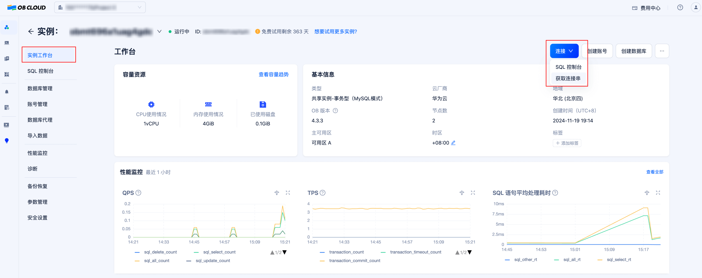
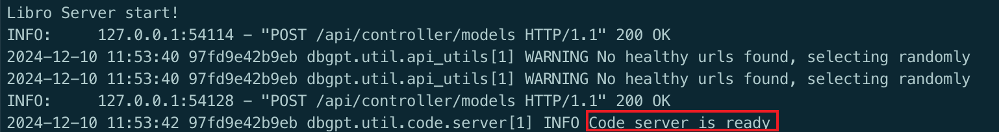
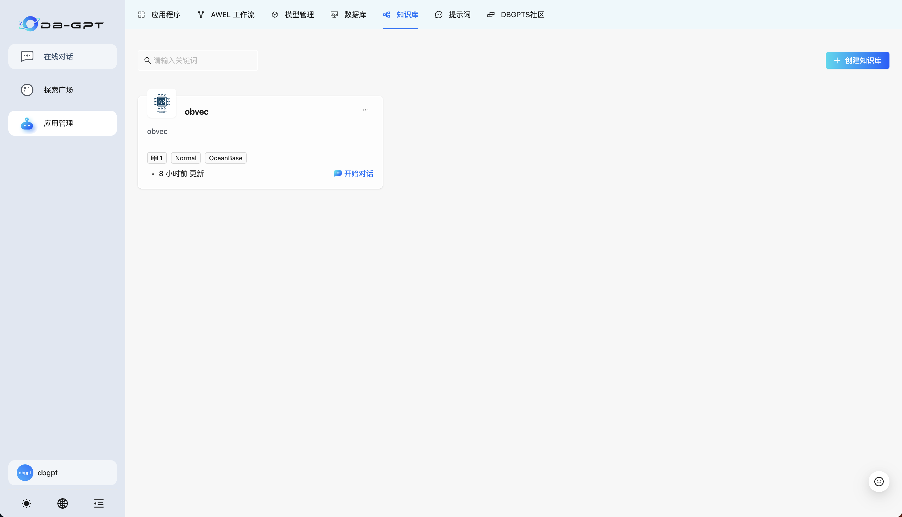
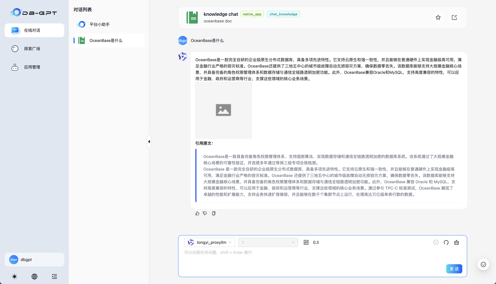

## 实验背景

🤖️ **DB-GPT是一个开源的AI原生数据应用开发框架(AI Native Data App Development framework with AWEL(Agentic Workflow Expression Language) and Agents)。**

目的是构建大模型领域的基础设施，通过开发多模型管理(SMMF)、Text2SQL效果优化、RAG框架以及优化、Multi-Agents框架协作、AWEL(智能体工作流编排)等多种技术能力，让围绕数据库构建大模型应用更简单，更方便。 

OceanBase 从 4.3.3 版本开始支持了向量数据类型的存储和检索，并且经过适配可以作为 DB-GPT 的可选向量数据库，支持 DB-GPT 对结构化数据和向量数据的存取需求，有力地支撑其上 LLM 应用的开发和落地，同时 DB-GPT 也通过 `chat data`、`chat db` 等应用为 OceanBase 提升易用性。


## 实验环境

- Git
- [Docker](https://docs.docker.com/engine/install/)
- MySQL 客户端

## 平台搭建步骤

### 1. 获取 OceanBase 数据库

进行实验之前，我们需要先获取 OceanBase 数据库，目前可行的方式有两种：使用 OBCloud 实例或者[使用 Docker 本地部署单机版 OceanBase 数据库](#使用-docker-部署单机版-oceanbase-数据库)。我们在此推荐 OBCloud 实例，因为它部署和管理都更加简单，且不需要本地环境支持。

#### 1.1 注册并开通 OBCloud 实例

进入[OB Cloud 云数据库 365 天免费试用](https://www.oceanbase.com/free-trial)页面，点击“立即试用”按钮，注册并登录账号，填写相关信息，开通实例，等待创建完成。

#### 1.2 获取数据库实例连接串

进入实例详情页的“实例工作台”，点击“连接”-“获取连接串”按钮来获取数据库连接串，将其中的连接信息填入后续步骤中创建的 .env 文件内。



#### 1.3 创建数据库

创建数据库以存放示例数据以及向量数据。需要注意的是，在设置数据库名称的时候，为了便于用户在 DB-GPT 前端界面进行后续的操作，强烈不建议用户使用以下四种名称：（因为以下四种数据库名被 DB-GPT 保留，用户虽然能成功在 DB-GPT 侧建立连接，但是无法在 Web UI 中进行后续的应用管理操作）

- auth
- dbgpt
- test
- public


### 2. 申请模型 API KEY

在该后续步骤当中我们将使用阿里云百炼的模型服务，所以需要事先申请 API KEY。

首先，我们需要注册[阿里云百炼](https://bailian.console.aliyun.com/)账号，开通模型调用服务并获取 API Key


### 3. 克隆项目

> 现场体验的用户，请在登录上云服务器后，跳转到[5. 启动 Docker 容器](#5-启动-docker-容器)

为了简化部署流程，我们基于 DB-GPT 的 0.6.2 版本进行了修改，并且上传到了我们 fork 的代码仓库中。使用以下指令下载项目代码：

```bash
git clone https://github.com/oceanbase-devhub/DB-GPT
```

如果上述命令执行遇到问题，可能是访问 github 存在困难，可以使用以下指令从 gitee 获取项目代码：

```bash
git clone https://gitee.com/oceanbase-devhub/DB-GPT.git
```

### 4. 拉取 Docker 镜像

```bash
docker pull quay.io/oceanbase-devhub/dbgpt:latest
```

### 5. 启动 Docker 容器

进入项目代码所在的目录（以克隆 DB-GPT 项目所在的目录为根目录）：

```bash
cd ./DB-GPT/docker/compose_examples
```

执行 `create_container_with_config_check.sh` 脚本：

```bash
./create_container_with_config_check.sh
```

该脚本会做如下几件事：

* 要求用户设置相关参数，输出会包含各项的当前值，如果认可当前值，回车进行下一项；
* 设置完所有参数后，首先通过尝试一次 embedding 操作来验证 API KEY 设置是否有效；
* 如果 API KEY 验证通过，测试与 OceanBase 是否连通，连通则会进一步初始化测试数据，以便后续的实验步骤，测试数据包括四个表：
    
    1. users：记录了用户的姓名和邮箱；
    2. products：记录了产品的名称和价格；
    3. orders：记录了用户购买产品的订单信息；
    4. plant_and_animal_table：记录了一些动植物名称以及这些名称的向量表示；


下面请按照脚本要求逐项填写参数配置：


使用以下命令查看 DB-GPT 启动情况，如果观察到最后日志显示 `Code server is ready` 则启动成功：

```bash
docker logs -f dbgpt
```



## 访问 DB-GPT 平台

默认情况下，DB-GPT 的前端页面会启动在本机的`5670`端口上，也就是说可以通过访问当前机器的 IP 来访问 DB-GPT 的界面。也就是说如果我在笔记本上运行的话，我在浏览器上访问`localhost`即可（或者是内网 IP）；如果在服务器上部署 DB-GPT，则需要访问服务器的公网 IP。

初始界面下是不包含应用的，点击`应用管理`进入创建流程：


接下来将演示如何创建两种应用类型：

1. 典型的知识库 `RAG` 应用；
2. 基于 `text2SQL` 的 `chat data` 应用；

### 创建知识库

首先选择`知识库`，再点击`创建知识库`：


然后按照配置引导进行设置：

知识库名称、描述等可自定义。


这里我选择普通文档作为示例，用户可自行尝试其他类型。


点击`选择或拖拽文件`区域，选择符合格式要求的文件


默认选择`自动切片`，点击`切片处理`即可。耐心等待处理完成，处理会自动退出配置界面，并弹出成功消息



### 创建数据库连接

点击`数据库`，选择`OceanBase`数据库，`Create Now`：


根据 `OceanBase` 连接串提供的信息设置数据库名、用户名、主机地址、端口等信息（可以与[5. 启动 Docker 容器](#5-启动-docker-容器)一致）


创建成功即可在侧边栏看到连接信息：


### 创建知识库应用和 chat data 应用

选择`应用程序`，点击`创建应用`：


选择`原生应用模式`，应用名称和描述可自行定义：


应用类型选择 `Chat Knowledge`，参数选择我们刚刚创建好的知识库名称，模型在我们的配置下仅有 `tongyi_proxyllm` 可供选择，温度控制模型输出的随机性，值越大，模型输出越随机。设置完毕后保存，就可以看到在应用程序一栏中出现了我们定义的应用。


然后我们继续类似地创建 `chat data` 应用：


应用类型选择 `Chat Knowledge`，参数选择我们刚刚创建好的数据库连接，模型和温度含义与 `Chat Knowledge` 一致。


### 使用应用

回到`应用程序`页面，点击开始对话可以进入使用流程：


知识库应用——直接键入文本进行交互即可：



chat data 应用可以使用自然语言的方式告知大模型生成 SQL，并使用得到的数据进行可视化（需要注意的是 text2SQL 对大模型的能力要求较高，如果执行结果出现错误提示，可以尝试重试和修改提示词）。这一部分可以进行交互查询的表，请回顾[5. 启动 Docker 容器](#5-启动-docker-容器)，或者直接询问`数据库有哪些表`、`xxx表的结构定义`获取表的模式信息。


额外提供一些询问供用户尝试：

1. 查询价格超过25的产品，并用柱状图展示。注意查询结果不需要包含id列；
2. 查询所有用户；
3. 查询每个用户购买的产品总数量；
4. 查询每个用户购买的产品名和产品数量；
5. 可视化一下plant_and_animal_table表的名称向量列，并使用名称作为可视化数据点的标签。生成的SQL不要包含id列；

## 附录

### 使用 Docker 部署单机版 OceanBase 数据库

#### 1. 启动 OceanBase 容器

您可以使用以下命令启动一个 OceanBase docker 容器：

```bash
docker run --name=ob433 -e MODE=mini -e OB_MEMORY_LIMIT=8G -e OB_DATAFILE_SIZE=10G -e OB_CLUSTER_NAME=ailab2024_dbgpt -e OB_SERVER_IP=127.0.0.1 -p 2881:2881 -d quay.io/oceanbase/oceanbase-ce:4.3.3.1-101000012024102216
```

如果上述命令执行成功，将会打印容器 ID，如下所示：

```bash
af5b32e79dc2a862b5574d05a18c1b240dc5923f04435a0e0ec41d70d91a20ee
```

#### 2. 检查 OceanBase 数据库初始化是否完成

容器启动后，您可以使用以下命令检查 OceanBase 数据库初始化状态：

```bash
docker logs -f ob433
```

初始化过程大约需要 2 ~ 3 分钟。当您看到以下消息（底部的 `boot success!` 是必须的）时，说明 OceanBase 数据库初始化完成：

```bash
cluster scenario: express_oltp
Start observer ok
observer program health check ok
Connect to observer ok
Initialize oceanbase-ce ok
Wait for observer init ok
+----------------------------------------------+
|                 oceanbase-ce                 |
+------------+---------+------+-------+--------+
| ip         | version | port | zone  | status |
+------------+---------+------+-------+--------+
| 172.17.0.2 | 4.3.3.1 | 2881 | zone1 | ACTIVE |
+------------+---------+------+-------+--------+
obclient -h172.17.0.2 -P2881 -uroot -Doceanbase -A

cluster unique id: c17ea619-5a3e-5656-be07-00022aa5b154-19298807cfb-00030304

obcluster running

...

check tenant connectable
tenant is connectable
boot success!
```

使用 `Ctrl + C` 退出日志查看界面。

#### 3. 测试数据库部署情况（可选）

可以使用 mysql 客户端连接到 OceanBase 集群，检查数据库部署情况。

```bash
mysql -h127.0.0.1 -P2881 -uroot@test -A -e "show databases"
```

如果部署成功，您将看到以下输出：

```bash
+--------------------+
| Database           |
+--------------------+
| information_schema |
| mysql              |
| oceanbase          |
| test               |
+--------------------+
```

#### 4. 修改参数启用向量模块

可通过下面的命令将`test`租户下的`ob_vector_memory_limit_percentage`参数设置为非零值，以开启 OceanBase 的向量功能模块。

```bash
mysql -h127.0.0.1 -P2881 -uroot@test -A -e "alter system set ob_vector_memory_limit_percentage = 30"
```
